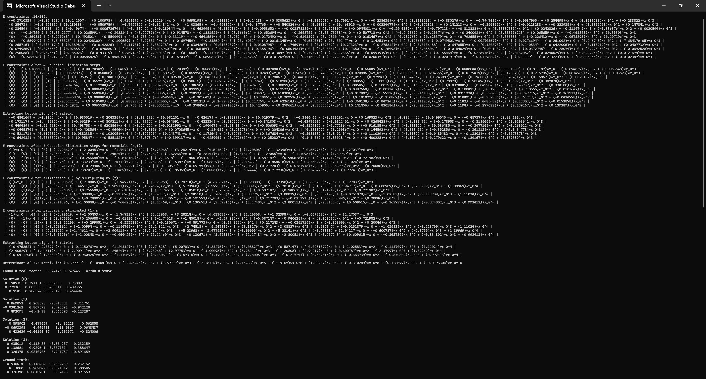

# polynomial

Small header-only C++ numerical polynomial analysis library for visualizing, manipulating, and evaluating polynomial systems with real (floating point or integer) coefficients.
Requires at least C++17 and the only dependency is [Eigen](https://libeigen.gitlab.io/).

Non-linear multivariate equation systems are the starting point of many minimal computer vision solvers such as those for camera motion estimation.
I use this library as a tool to develop toy implementations of such solvers mainly to visualize and understand implementation details which are usually ommitted in their respective papers.
This library is intended for didactic purposes: if you wish to solve such problems and develop efficient solvers consider instead using the ["Automatic Generator of Minimal Problem Solvers"](https://cmp.felk.cvut.cz/~kukelova/publications/Kukelova-etal-ECCV-2008.pdf) of Kukelova et al.

This library supports (Eigen) matrices of polynomials and polynomials with polynomial coefficients (you can also have polynomials of polynomials of polynomials of ... if for some reason that makes sense for your application).
Not all matrix operations are supported, in particular any operations that require division by anything other than a scalar are not supported.
However, the library provides some building blocks to implement your own reduction ([polynomial division](https://en.wikipedia.org/wiki/Gr%C3%B6bner_basis#Reduction)) routines.

Here is an example solver implementation:

https://github.com/jdibenes/polynomial/blob/872cd2afe02d525d6153ffa97254a60609520095/examples/relative_pose_easy.cpp#L1-L286

and the output is:

